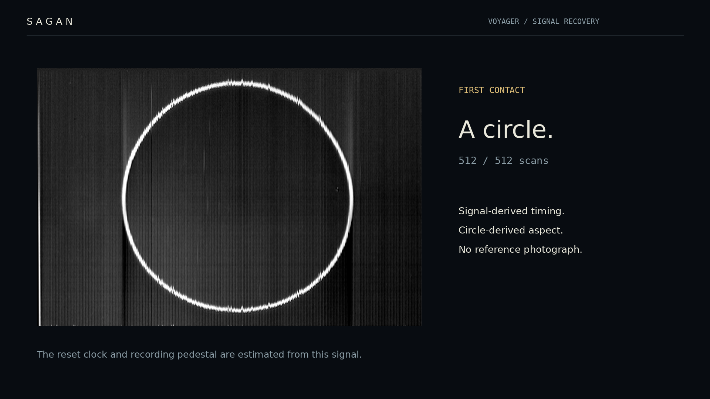

# Golden Record

Voyager Golden Record signal decoder. Recovers 156 grayscale raster planes from a stereo preservation recording.

[Video](demo/sagan.mp4) · [Decoded planes](output/) · [Method](docs/method.md)

[](demo/sagan.mp4)

## Run

Python 3.12, FFmpeg and DejaVu Sans. The source recording requires a 1.46 GB download and about 4 GB RAM.

```sh
python -m venv .venv
. .venv/bin/activate
pip install -r requirements.txt
python scripts/fetch.py
python scripts/decode.py
python scripts/render_demo.py
python scripts/verify.py
```

To render the included results, run `python scripts/render_demo.py` after installing dependencies. The saved soundtrack is included.

## Data

The [cover instructions](https://science.nasa.gov/mission/voyager/golden-record-cover/) specify vertical scans, 512 lines and a calibration circle. [Provenance](data/provenance.json) records source URLs and checksums.

The input is a public preservation copy with an unverified chain of custody. Recovery retains analog artifacts; color-channel assembly is incomplete. The 156 planes include separate color components. Prior decoding discussions were encountered during source research; this was not a blind test.

[MIT](LICENSE) covers original code. Record contents retain their [original rights](DATA-NOTICE.md).
